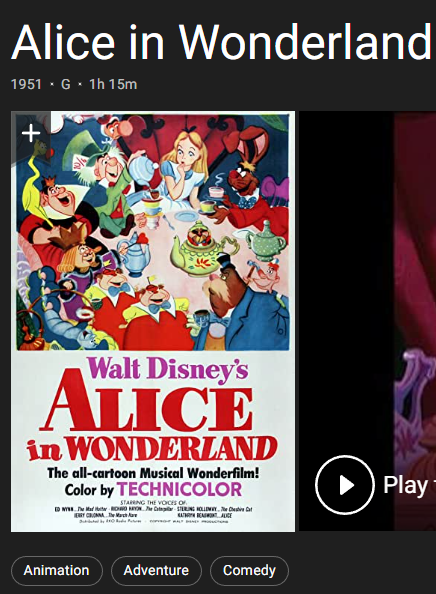

# CS7641-Midterm Report
Proposal for CS7641 project
____________________________________________________________________________________________________________________________________
# Dataset: 
[1] https://www.kaggle.com/datasets/ebiswas/imdb-review-dataset?select=sample.json

[2] https://www.kaggle.com/datasets/darshan1504/imdb-movie-reviews-2021
____________________________________________________________________________________________________________________________________
# Introduction/Background:
Unlike the traditional commercial model that consumers find what they want in stores, today's commercial website will help users discover new products and services via using a recommendation system. It not only benefits websites from selling their products but also prevents consumers from being overwhemlmed by too many options of products. Schafer, J.B., Konstan, J.A., & Riedl, J. (2004) analyzed 6 websites that lead the 2004 market: 1. Amazon.com, CDNOW, Drugstore.com, eBay, MovieFinder.com, and Reel.com. Even though they are targeting different industries, their recommendation system relies on information from both items or users, particularly relying on consumers' ratings of products or services. Roy, D., Dutta, M. (2022) categorized recommender systems into three different types: 1. content-based recommender systems, 2. collaborative recommender systems, and 3. hybrid recommender systems. In collaborative recommender system, this system applies users' features. The collaborative recommender system work based on the users' similarity. The hybrid recommender system integrates more than two techniques to mitigate the weakness from each separate recommender technique. As Jayalakshmi S, Ganesh N, Čep R, Senthil Murugan J. (2022) mentioned, an excellent films recommendation system will make recommendations for films that most closely match the similarities. We gather two datasets for the project: one has users' rating of movies and another one have detailed information about films. They shared the same film name, so we will merge them in the future.

# Problem Definition:
The goal of this project is to predict and recommend what films the user prefer via building a Films Recommendation System. With the prevalence of online services, more and more people can review and rating films so a significant amount of information about films are created. Audience have to spend more time searching film information to decide if they want to watch the film. This project is important to work on because it save consumers time from searching information about films or other services. If film companies, like Netflix, can accurately recommend what users like, they benefit from the system by expanding customer market and harnessing their purchasing power.

## Data Collection:
Currently we have two kinds of datasets, one consisting of user comments and their rating to different movies, second have details about each movie, this includes genre, run time, published years and actors, Etc. Since we are focusing on clustering, which is unsupervised learning first, so we mainly utilize the second dataset and trying to find similarity between movies. We remove datapoints that does not contain genre, since it is the main difference between movies and we expanded variable 'genre' into 32 dummy variables, 1 indicate the movie contain this genre. On dataset one, we are planning combine it to data set 2 based on the name of the file, so details about the film will still be the features and user rating will be the y to guide our model. For dataset one with user information, we isolated different users and planning do a model for everyone, but this requires one user to rate a lot of movies, but for the most of time, one user only comment on few movies, so we then want to utilize sparse matrix format and handcrafted features for a more general model after. 

# Methods, Matrixes and Potential Results Discussion
## Supervised Method:
1. Regression
2. Tree-based method 

### Matrix for Supervised Methods:
We choose several matrixes to evaluate models’ performance. Firstly, we will compute the confusion matrix and the calculate precision and recall rate as well as graphing of ROC AUC. Secondly, we will use some additional matrix to assist to evaluate models, such as the F-beta score

### Potential Results Discussion for Supervised Methods:
Our group expect models with higher recall rate (0.7) because False negative means that the recommendation system does not predict what clients like to watch. If the model can achieve higher recall rate, we can accept relatively lower precision rate (0.6). Secondly, we expect a ROC graph’s angle close to the right angle and the AUC is greater than 0.7. F1 score take into account of both false positive and false negative.

## Unsupervised Methods:
1. Hierarchical Clustering Algorithm
2. Principle Component Analysis
3. Collaborative filtering
4. DBSCAN

## Update Method that we already tried:
1. Hierarchical Clustering Algorithm 
2. K-Prototypes
3. DBSCAN

### Matrix for Unsupervised Methods: 
we will choose four matrixes to evaluate the models' performance
1.	Silhouette Coefficient

### Results Discussion for Hierarchical Clustering Algorithm:
Our group tested hierarchical clustering with all different settings, this includes four linkage type: ward, complete, average, and single linkage, and different connectivity constrains. Since we don’t have a true label for our data, so we runed silhouette coefficient to analysis the coherence of our clusters. In our testing, the linkage type ward performs the best with a silhouette coefficient around zero point five. It reaches the best performance around a hundred and ten clusters, within the same clusters movies often have two to three exactly same genres and similar runtime. below is an example cluster for silhouette coefficient around 0.5. [pictures from IMDB website]

cluster 1:['Balto', 'Pocahontas', 'James and the Giant Peach', 'The Land Before Time III: The Time of the Great Giving', 'Alice in Wonderland', 'The Fox and the Hound', 'Aladdin and the King of Thieves',...]

number of movies in cluster 1: [193]

   

an example with lower silhouette coefficient around 0.2 is below, movies with in the same cluster often only have one or two same genre, and the runtime varies by alot. But there are way more movies in one cluster so we have more to recomend to the users.

cluster 1: ['Screamers', 'Crumb', 'Judge Dredd', 'Species', 'Strange Days', 'Hoop Dreams', "Mary Shelley's Frankenstein", 'Outbreak', 'Jurassic Park',...]

number of movies in cluster 1: [1237]

  

A quick comparison between different linkage setting.

 

mark up: 

           
"linkage type = ward"

           
linkge type is ward, number of cluster from 10 to 200

         

         
 

mark up: 

           
"linkage type = complete"

           
linkge type is complete, number of cluster from 10 to 200

         

 

mark up: 

           
"linkage type = average"

           
linkge type is average, number of cluster from 10 to 200

         

 

mark up: 

           
"linkage type = single"

           
linkge type is single, number of cluster from 10 to 200

         

comparing all different kind of linkage types, ward minimized the sum of squared differences within all cluster, it is a variance-minimizing approach and provide best result among all four types of linkage. other types of linkage provide a small even negative silhouette coefficient which indicates some movies are in the wrong cluster, so for Hierarchical Clustering Algorithm we choose ward linkage to be the best solution for it.

### Results Discussion for K-ProtoType:

K-mean is used for numerical data, and k-mode is only suitable for categorical data types; in our case, we have mix types of data, so we used the K-protoType algorithm to do the clustering. This method is proposed by Huang, Z. (1997). 

We do not have completed results from K-ProtoType. This is because computational cost for using such method is too high. We executed for a week but still do not have much results. The only result is that cost=403.2974 given number of clusters = 100. The cost is defined as the sum of distance of all points to their respective cluster centrids.

### Results Discussion for DBSCAN:

We use DBSCAN to identify clusters with varying shapes. Benefits of applying DBSCAN techniques doesn’t require having a predetermined set of clusters since it only looks at dense regions and it is flexible to identify clusters with different shapes and sizes within a data set. First, we need to optimize the two parameters: epsilon as the radius of each circle and MinPts as the minimum number of points to form a cluster. First, we need to find the optimal minimum points as a basis to find the best epsilon.For MinPts, we follow the general rule of thumb: if our movie set has more than two dimensions, the minimum points = 2 * number of dimensions (Sander et al., 1998) [6].

For MinPts, we follow the general rule of thumb: if our movie set has more than two dimensions, the minimum points = 2 * number of dimensions (Sander et al., 1998). Thus, the optimal number of cluster is 33 * 2 = 66 for our movie data set. By producing a k-distance elbow plot, with y value as the computed average distance between each data point and x value as the number of neighbors, we find the point of maximum curvature as approximately 0.05. With a combination of MinPts = 66 and epsilon = 0.05, we use the sklearn DBSCAN function and find the optimal number of clusters as 97 and the number of noise points as 10076.

Last but not least, we evaluate the DBSCAN with silhouette coefficient, which is bounded between -1 and 1. Higher score indicates the DBSCAN defines clusters with lower average intracluster distance and further intercluster distance from each other. The true cluster labels are unknown, we use the model itself to evaluate performance and it is appropriate to use the fit_predict() method to evaluate DBSCAN().

### Results Discussion for K-mean:

k-mean is a simple but popular unsupervised machine learning algorithms, as the first algorithm we learned in class we gave it a try as well. For K-mean, each observation belongs to the cluter wit hthe nearest mean, k-means clustering minimizes within-cluster vcariances, as the result, the k-mean algorithm returns a great coefficient.

 

but there is one problem burried under it, although the silhouette coefficient is high, but the number of movies in each cluster is not evenly distributed compared to Hierarchical Clustering. 

 

 

Out speculation is that due to the nature of this data set(genres are not evenly distributed) and K-mean, when a movie only have two genres or less, it gets clustered with other movie with only one same genre, Our result reflect this too, the top three clusters are movies with drama, comedy and thriller, when a movie consist this genre and only another one genre, it gets clustered with three biggest clusters. we are still working on how to further break these big clusters apart, K-ProtoType might be one soulution to this problem.

# Proposal Video link:
https://clipchamp.com/watch/qPwhHl32ECc

# Comtribution Table:
|name |contribution|
|---|---|
|Siyuan Chen | test and tunning for Hierarchical Clustering Algorithm, data processing and visualization|
|Dihong Huang| clean data and test K-prototype Algorithm|
|Jinsong Zhen| Apply DBSCAN techniques, write result dicussions, collaborate with Zongzhen for the Introduction/Background and Problem Definition|
|Zongzhen Lin| lead and coordinated the group to achieve the midterm report; working on Introduction/Background, Problem Definition, Data collection, K-Prototype|

# References:
[1] Roy, D., Dutta, M. A systematic review and research perspective on recommender systems. J Big Data 9, 59 (2022). https://doi.org/10.1186/s40537-022-00592-5

[2] Schafer, J.B., Konstan, J.A., & Riedl, J. (2004). E-Commerce Recommendation Applications. Data Mining and Knowledge Discovery, 5, 115-153.

[3] Jayalakshmi S, Ganesh N, Čep R, Senthil Murugan J. Movie Recommender Systems: Concepts, Methods, Challenges, and Future Directions. Sensors (Basel). 2022 Jun 29;22(13):4904. doi: 10.3390/s22134904. PMID: 35808398; PMCID: PMC9269752.

[4] IMDB website at https://www.imdb.com/ to help team find detail information about movies.

[5] (1, 2) Huang, Z.: Clustering large data sets with mixed numeric and categorical values, Proceedings of the First Pacific Asia Knowledge Discovery and Data Mining Conference, Singapore, pp. 21-34, 1997.

[6] Ester, Martin, Hans-Peter Kriegel, Jiirg Sander, and Xiaowei Xu. n.d. “A Density-Based Algorithm for Discovering Clusters in Large Spatial Databases with Noise.” https://www.aaai.org/Papers/KDD/1996/KDD96-037.pdf.
