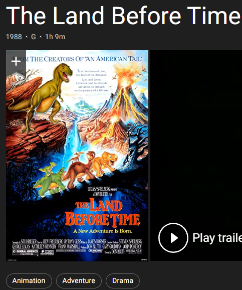
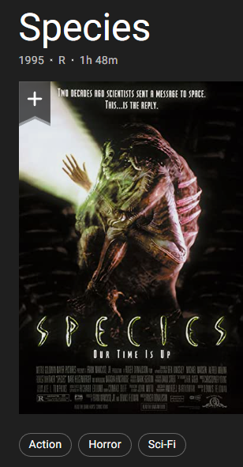

# CS7641-Midterm Report
Proposal for CS7641 project
____________________________________________________________________________________________________________________________________
# Dataset:
https://www.kaggle.com/datasets/shivamb/netflix-shows  
https://www.kaggle.com/datasets/shivamb/amazon-prime-movies-and-tv-shows   
https://www.kaggle.com/datasets/shivamb/disney-movies-and-tv-shows   
https://www.kaggle.com/datasets/shivamb/hulu-movies-and-tv-shows  
https://www.kaggle.com/datasets/ebiswas/imdb-review-dataset?select=sample.json
https://www.kaggle.com/datasets/darshan1504/imdb-movie-reviews-2021
____________________________________________________________________________________________________________________________________
# Introduction/Background:
Unlike the traditional commercial model that consumers find what they want in stores, today's commercial website will help users discover new products and services via using a recommendation system. It not only benefits websites from selling their products but also prevents consumers from being overwhemlmed by too many options of products. Schafer, J.B., Konstan, J.A., & Riedl, J. (2004) analyzed 6 websites that lead the 2004 market: 1. Amazon.com, CDNOW, Drugstore.com, eBay, MovieFinder.com, and Reel.com. Even though they are targeting different industries, their recommendation system relies on information from both items or users, particularly relying on consumers' ratings of products or services. Roy, D., Dutta, M. (2022) categorized recommender systems into three different types: 1. content-based recommender systems, 2. collaborative recommender systems, and 3. hybrid recommender systems. In collaborative recommender systems, this system uses users' features to recommend. The collaborative recommender systems work based on the similarity between users. The hybrid recommender system combines two or more techniques and uses them all at once to overcome the shortcomings of each separate recommender technique. We gather two datasets for the project: one has users' rating of movies and another one have detailed information about films. They shared the same film name, so we will merge them in the future. As Jayalakshmi S, Ganesh N, Čep R, Senthil Murugan J. (2022) mentioned,  an excellent films recommendation system will make recommendations for films that most closely match the similarities.

# Problem Definition:
The goal of this project is to predict and recommend what films the user may like via building a Films Recommendation System. With the prevalence of online services, more and more people can review and rating films so a significant amount of information about films are created. Audients have to spend so much time searching film information to decide if they want to watch the film. This project is important to work on because it can help consumers save time from searching for information on films or other services. Also, if film companies, like Netflix, can accurately recommend what users like, more audients will be attracted. Then they can also be benefit from the system by developing more potential customers and their potential purchasing power.

## Updata: Data Collection:
Currently we have two kinds of datasets, one consisting of user comments and their rating to different movies, second have details about each movie, this includes genre, run time, published years and actors, Etc. Since we are focusing on clustering, which is unsupervised learning first, so we mainly utilize the second dataset and trying to find similarity between movies. We remove datapoints that does not contain genre, since it is the main difference between movies and we expanded variable 'genre' into 32 dummy variables, 1 indicate the movie contain this genre. On dataset one, we are planning combine it to data set 2 based on the name of the file, so details about the film will still be the features and user rating will be the y to guide our model. For dataset one with user information, we isolated different users and planning do a model for everyone, but this requires one user to rate a lot of movies, but for the most of time, one user only comment on few movies, so we then want to utilize sparse matrix format and handcrafted features for a more general model after. 

# Methods, Matrixes and Potential Results Discussion
## Supervised Method:
1. Regression
2. Tree-based method 

### Matrix for Supervised Methods:
We choose several matrixes to evaluate models’ performance. Firstly, we will compute the confusion matrix and the calculate precision and recall rate as well as graphing of ROC AUC. Secondly, we will use some additional matrix to assist to evaluate models, such as the F-beta score

### Potential Results Discussion for Supervised Methods:
Our group expect models with higher recall rate (0.7) because False negative means that the recommendation system does not predict what clients like to watch. If the model can achieve higher recall rate, we can accept relatively lower precision rate (0.6). Secondly, we expect a ROC graph’s angle close to the right angle and the AUC is greater than 0.7. F1 score take into account of both false positive and false negative.

## Unsupervised Methods:
1. Hierarchical Clustering Algorithm
2. Principle Component Analysis
3. Collaborative filtering
4. DBSCAN

## Updata Method that we already used:
1. K-means
2. K-Prototypes
3. Hierarchical Clustering Algorithm 
4. DBSCAN

### Matrix for Unsupervised Methods: 
we will choose four matrixes to evaluate the models' performance
1.	fowlkes_mallows_score
2.	homogeneity_score
3.	mutual_info_score
4.	rand_score
5.	distance: Euclidean Distance, Pearson Coefficient

### Results Discussion for Hierarchical Clustering Algorithm:
Our group tested hierarchical clustering with all different settings, this includes four linkage type: ward, complete, average, and single linkage, and different connectivity constrains. Since we don’t have a true label for our data, so we runed silhouette coefficient to analysis the coherence of our clusters. In our testing, the linkage type ward performs the best with a silhouette coefficient around zero point five. It reaches the best performance around a hundred and ten clusters, within the same clusters movies often have two to three exactly same genres and similar runtime. below is an example cluster for silhouette coefficient around 0.5. [pictures from IMDB website]

cluster 1:['Balto', 'Pocahontas', 'James and the Giant Peach', 'The Land Before Time III: The Time of the Great Giving', 'Alice in Wonderland', 'The Fox and the Hound', 'Aladdin and the King of Thieves',...]

numer of movies in cluster 1: [193]

   

an axample with lower silhouette coefficient around 0.2 is below, movies with in the same cluster often only have one or two same genre, but there are way mroe movies in one cluster so we have more to recomend to the users.

cluster 1: ['Screamers', 'Crumb', 'Judge Dredd', 'Species', 'Strange Days', 'Hoop Dreams', "Mary Shelley's Frankenstein", 'Outbreak', 'Jurassic Park',...]

numer of movies in cluster 1: [1237]

  

# Video link:
https://clipchamp.com/watch/qPwhHl32ECc

# References:
[1] Kumar, P. (n.d.). How Netflix uses data for customer retention. Sigma Magic. Retrieved from https://www.sigmamagic.com/blogs/netflix-data-analysis/#:~:text=One%2Dway%20Netflix%20uses%20to,end%20up%20cancelling%20the%20subscription

[2] Zhang, Y., &amp; Zhang, L. (2022). Movie recommendation algorithm based on sentiment analysis and LDA. Procedia Computer Science, 199, 871–878. https://doi.org/10.1016/j.procs.2022.01.109

[3] Pang, B. (2002). Thumbs up? sentiment classification using machine ... - cornell university. Proceedings of EMNLP 2002, pp. 79–86. Retrieved from https://www.cs.cornell.edu/home/llee/papers/sentiment.pdf

[4] Shetty, B. (2019, July 24). An In-Depth Guide to How Recommender Systems Work. Built In. Retrieved from https://builtin.com/data-science/recommender-systems 

## Updata
[1] Roy, D., Dutta, M. A systematic review and research perspective on recommender systems. J Big Data 9, 59 (2022). https://doi.org/10.1186/s40537-022-00592-5

[2] Schafer, J.B., Konstan, J.A., & Riedl, J. (2004). E-Commerce Recommendation Applications. Data Mining and Knowledge Discovery, 5, 115-153.

[3] Jayalakshmi S, Ganesh N, Čep R, Senthil Murugan J. Movie Recommender Systems: Concepts, Methods, Challenges, and Future Directions. Sensors (Basel). 2022 Jun 29;22(13):4904. doi: 10.3390/s22134904. PMID: 35808398; PMCID: PMC9269752.
